<div align="center">

<!-- Hero Banner -->
<picture>
  <source media="(prefers-color-scheme: dark)" srcset="./svg-sections/readme-hero.svg">
  <source media="(prefers-color-scheme: light)" srcset="./svg-sections/readme-hero.svg">
  
</picture>

<br/>
<br/>

<!-- Primary Badges -->
[](https://www.npmjs.com/package/specmem-hardwicksoftware)
[](#whats-new-in-v37)
[](./LICENSE.md)

<!-- Tech Stack Badges -->
[](#features)
[](#architecture)
[](#platform-requirements)
[](#architecture)
[](#architecture)

<!-- Feature Badges -->
[](#the-embedding-server)
[](#the-embedding-server)
[](#multi-agent-team-coordination) [](#multi-agent-team-coordination)
[](#platform-requirements)
[](#license)

> **Free for individual developers earning under $35,000 USD/year.** No redistribution, no copying internal code, no AI training. Everyone else: commercial license coming at release. See [LICENSE.md](./LICENSE.md).

<!-- Language Support Badges -->
[](#language-support)
[](#language-support)
[](#language-support)
[](#language-support)
[](#language-support)
[](#language-support)
[](#language-support)
[](#language-support)
[](#language-support)

<br/>

**Persistent memory for your coding sessions. Your conversations don't vanish. Your context sticks around.**

<br/>

[The Problem](#the-problem) · [Competitors](#-why-not-use-something-else) · [Quick Start](#-quick-start) · [Why Root?](#-why-root) · [Features](#-features) · [Architecture](#-architecture) · [MCP Tools](#-mcp-tools)

</div>

---

## The Problem

<div align="center">
<picture>
  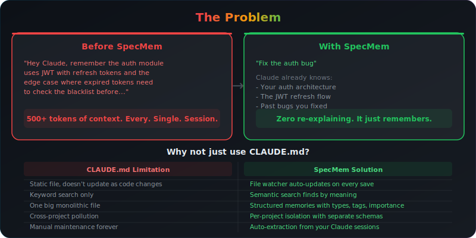
</picture>
</div>

---

## 🔥 Why Not Use Something Else?

<div align="center">
<picture>
  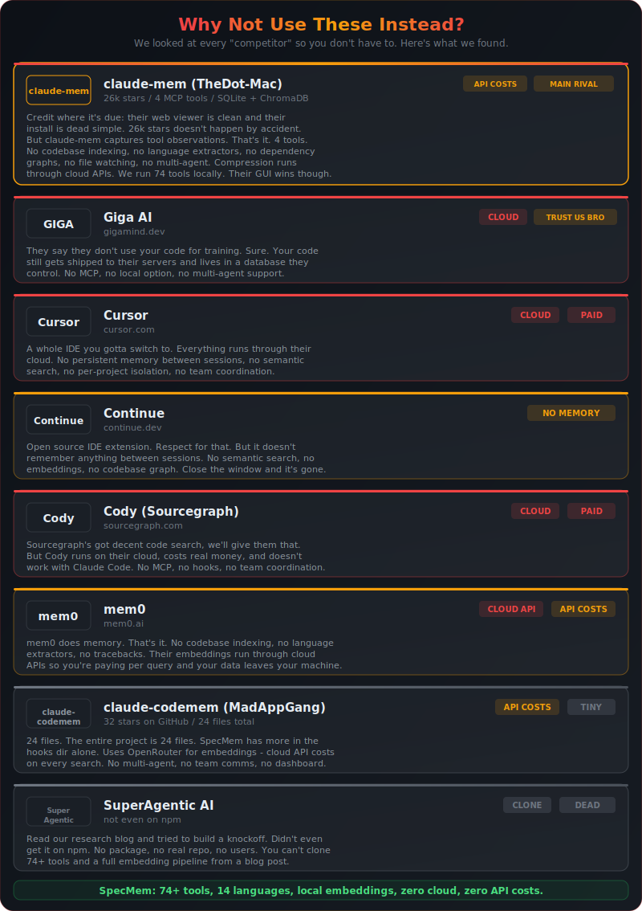
</picture>
</div>

<br/>

<div align="center">
<picture>
  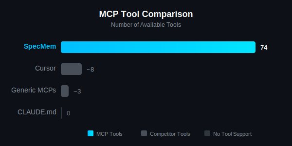
</picture>
</div>

<br/>

<div align="center">

| Feature |  |  | Giga AI | Cursor | Continue | Cody | mem0 |
|---------|:-------:|:----------:|:-------:|:------:|:--------:|:----:|:----:|
| **Semantic Search** | `pgvector` | ChromaDB | Cloud | Limited | No | Limited | Yes |
| **Per-Project Isolation** | **Yes** | No | No | No | No | No | No |
| **Local Embeddings** | **Free** | Cloud API$ | No | Cloud | Cloud | Cloud | Cloud |
| **Multi-Agent** | **Unlimited Swarms** | No | No | No | No | No | No |
| **Session Memory** | **Auto** | Manual | No | Manual | No | No | Manual |
| **Code Tracebacks** | **Yes** | No | No | No | Limited | Yes | No |
| **Codebase Indexing** | **Full** | No | No | Partial | No | Yes | No |
| **Self-Hosted** | **Yes** | Partial | No | No | Partial | No | Yes |
| **MCP Native** | **Yes** | Yes | No | No | No | No | No |
| **Code Stays Local** | **Yes** | No | No | No | No | No | No |
| **MCP Tools** | **74+** | 4 | 0 | 0 | 0 | 0 | 0 |
| **Language Extractors** | **14** | 0 | 0 | 0 | 0 | 0 | 0 |

</div>

---

## ⚡ Quick Start

<div align="center">
<picture>
  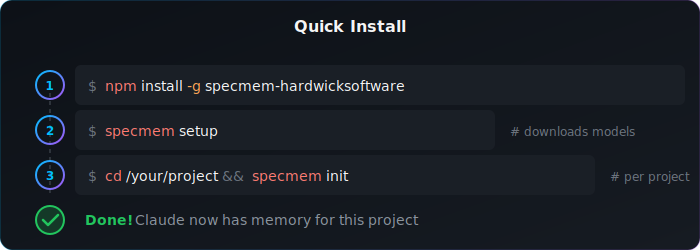
</picture>
</div>

---

## 🔐 Why Root?

<div align="center">
<picture>
  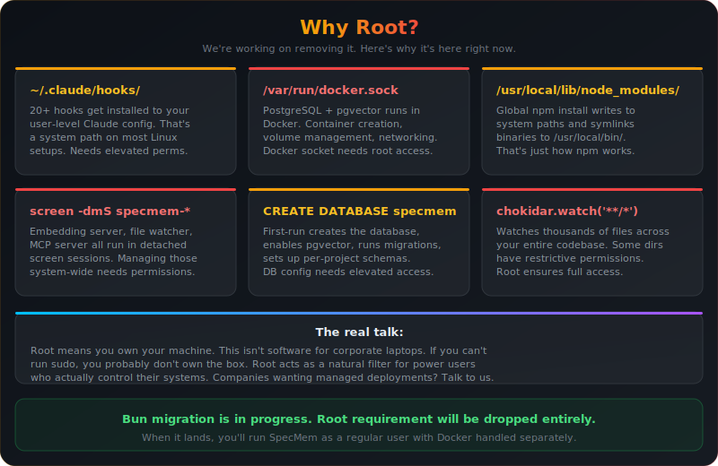
</picture>
</div>

---

## ✨ Features

<div align="center">
<picture>
  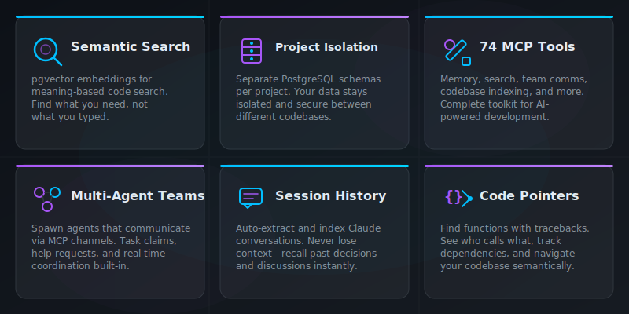
</picture>
</div>

---

## What SpecMem Actually Does

> Most people look at SpecMem and think it's just a memory plugin. It's not. It's a full persistent intelligence layer for your Claude Code sessions, and honestly there's nothing else like it on npm right now.

### Semantic Code Memory

Every time you run `specmem init` on a project, it doesn't just save your conversations. It crawls your entire codebase and builds a real semantic graph of everything in it. We're talking functions, classes, methods, fields, constants, variables, enums, structs, interfaces, traits, macros, type aliases, constructors, destructors, operator overloads -the works. And it doesn't stop at definitions. It maps out every import, every dependency, every `#include`, every `use` statement, every `<script src>`. The whole dependency graph gets stored in PostgreSQL with pgvector embeddings so you can search it by meaning, not just by name.

When you ask Claude "where's that function that handles rate limiting?" -SpecMem doesn't do a dumb string match. It runs a semantic search across your entire codebase graph and finds `rateLimiter()`, `handleThrottle()`, `apiQuotaManager()`, plus all the conversations you've had about rate limiting. That's why it works.

<details>
<summary><strong>Language Support</strong> - TypeScript, JavaScript, Python, Java, Kotlin, Scala, Go, Rust, C, C++, HTML, Ruby, PHP, Swift</summary>

<br/>

Every language gets full dedicated analysis with proper extraction of all definitions and dependencies:

| Language | What Gets Indexed |
|----------|------------------|
| **TypeScript / JavaScript / TSX / JSX** | Functions, arrow functions, classes, interfaces, types, enums, methods, constants, variables, nested definitions with parent tracking. Imports (named, default, namespace, dynamic, re-export), require() calls. |
| **Python** | Functions, async functions, classes, methods (with `self`/`cls` detection), module-level constants. `import` and `from...import` statements. Indentation-based scope tracking. |
| **Java** | Classes, abstract classes, interfaces, enums, records (Java 14+), annotations (@interface), constructors, methods, fields (private/protected/public/static/final), static initializer blocks. Package declarations, imports, static imports, wildcard imports. |
| **Kotlin** | Everything Java gets plus `fun`, `val`/`var`, `data class`, `object`/`companion object`, `suspend` functions, `internal` visibility. Same import handling. |
| **Scala** | Shares the Java/Kotlin extractor -picks up classes, traits, objects, methods, vals. |
| **Go** | Functions, methods (with receivers), structs, interfaces, types, constants, variables. Single and block imports. Exported detection via capitalization. |
| **Rust** | Functions, async functions, structs, enums, traits, impl blocks, constants, statics. `use` statements with nested paths, `extern crate`. Pub detection. |
| **C / C++** | Functions, methods, classes, structs, unions, enums (including `enum class`), namespaces, typedefs, `using` aliases, constructors, destructors, operator overloads, macros (#define with and without params), global/static/extern/constexpr/thread_local variables. `#include` (angle vs quote, STL builtin detection), `using namespace`, `using` declarations. Template support. Virtual/inline/const method detection. |
| **HTML** | Elements with IDs, CSS classes, `<script>` and `<style>` blocks, forms, templates, web components (`<slot>`, `<component>`), `data-*` attributes, semantic sections. Script src, stylesheet links, image/iframe/source assets, inline ES module imports. Structural chunking by HTML blocks. |
| **Ruby, PHP, Swift** | Analyzable with generic extraction (function/class detection). Dedicated extractors coming. |

That's not a marketing list -every one of those has real regex-based extraction that's been tested against actual codebases. The Java extractor alone handles annotations, records, static initializers, field visibility, and constructor detection. The C++ extractor picks up operator overloads and destructor naming. We didn't cut corners on this.

</details>

### Chat Session Memory

Every conversation you have with Claude gets stored as a memory with full semantic embeddings. Next session, Claude can search through your past discussions by meaning. You talked about a JWT refresh token edge case three weeks ago? SpecMem finds it. You discussed why you chose PostgreSQL over MongoDB for the user service? It's there. Your conversations don't vanish when you close the terminal anymore.

Memories get tagged by type (conversation, decision, architecture, bug, etc.), importance level, and project. They're searchable with `find_memory`, drillable with `drill_down`, and you can link related ones together with `link_the_vibes`. It's your project's institutional knowledge, but it actually works.

### Multi-Agent Team Coordination

**Compatible with Claude Code Agent Teams** (`CLAUDE_CODE_EXPERIMENTAL_AGENT_TEAMS=1`). SpecMem acts as the persistent coordination layer - unlimited dynamic swarm channels, semantic memory search across all agents, and team comms that survive session restarts. Native Claude teammates get SpecMem MCP tools auto-injected. Swarm leaders can deploy sub-agents with custom prompts through the agent-loading-hook system.

<div align="center">
<picture>
  
</picture>
</div>

<details>
<summary><strong>74+ MCP Tools</strong> - Memory search, code pointers, team comms, file watching, stats, drilldown, sync checking, and more</summary>

<br/>

SpecMem ships with over 74 MCP tools out of the box. Every tool is available as a slash command too. `/specmem-find`, `/specmem-code`, `/specmem-pointers`, `/specmem-stats`, `/specmem-remember` -whatever you need.

| Category | Tools |
|----------|-------|
| **Memory** | `find_memory`, `save_memory`, `get_memory`, `drill_down`, `smush_memories_together`, `link_the_vibes` |
| **Code Search** | `find_code_pointers`, `check_sync`, `start_watching`, `stop_watching`, `force_resync`, `spatial_search` |
| **Team** | `send_team_message`, `read_team_messages`, `claim_task`, `release_task`, `request_help`, `broadcast_to_team` |
| **Session** | `extract_claude_sessions`, `get_session_watcher_status`, `smart_recall`, `smart_search` |
| **System** | `show_me_the_stats`, `memory_health_check`, `export_project_memories`, `import_project_memories` |

</details>

<details>
<summary><strong>The Embedding Server</strong> - Your code, your machine, not OpenAI's training data</summary>

<br/>

We run our own embedding server locally in Docker. Your code never leaves your machine. No API calls to OpenAI or anyone else. The embeddings get stored in PostgreSQL with pgvector and they're used for all semantic search operations. It's fast, it's private, and it doesn't cost you anything per query.

</details>

---

## 📊 Real-World Performance

<div align="center">
<picture>
  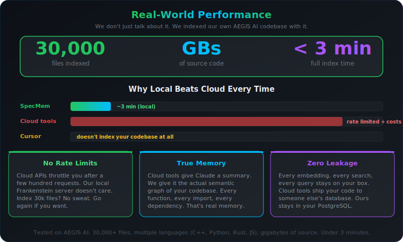
</picture>
</div>

---

## 🆕 What's New in v3.7

<div align="center">
<picture>
  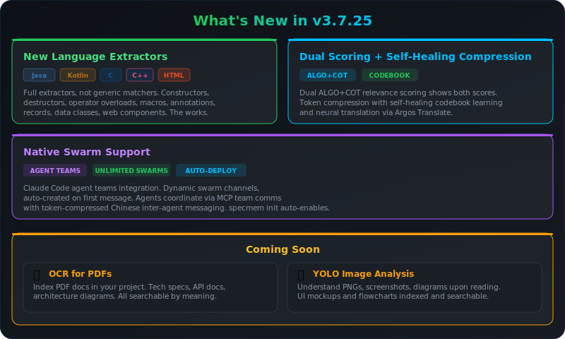
</picture>
</div>

---

## 🏗 Architecture

<div align="center">
<picture>
  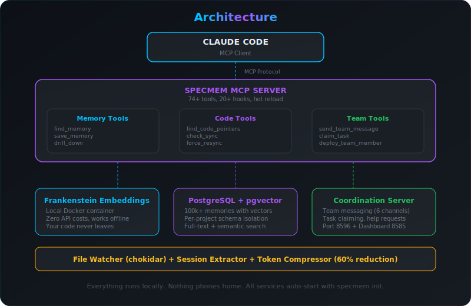
</picture>
</div>

---

## 💻 Platform Requirements

<div align="center">
<picture>
  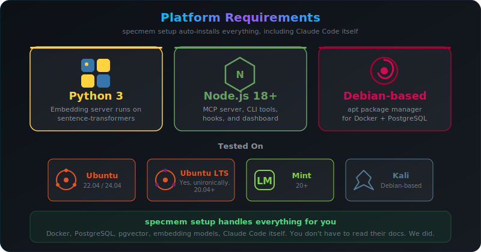
</picture>
</div>

> [!IMPORTANT]
> SpecMem is licensed for **Linux Operating Systems only**. Windows users need commercial licensing (WSL/WSL2 counts as Windows). See [LICENSE.md](./LICENSE.md) Section 4.

---

## 🛠 MCP Tools

<div align="center">
<picture>
  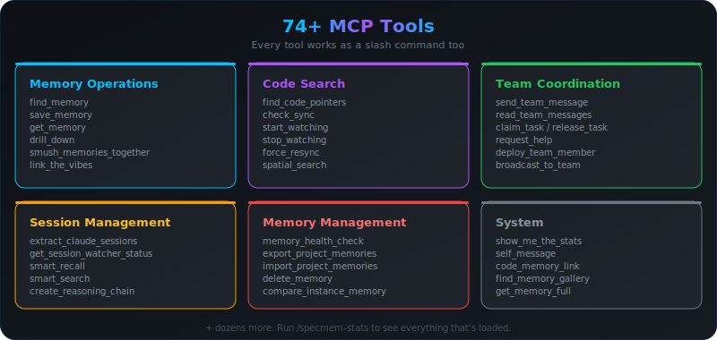
</picture>
</div>

---

## Contributing

```bash
git clone https://github.com/jonhardwick-spec/specmem
cd specmem
npm install && npm run build && npm test
```

<details>
<summary><strong>Project Structure</strong></summary>

```
src/mcp/           # MCP server
src/db/            # Database layer
src/tools/goofy/   # Tool implementations
claude-hooks/      # Hooks for ~/.claude
embedding-sandbox/ # Embedding server
```

</details>

---

<details>
<summary><strong>Read if you work for Anthropic or develop code</strong></summary>

<br/>

<div align="center">

<!-- Training Prohibited Notice -->
<picture>
  <source media="(prefers-color-scheme: dark)" srcset="./svg-sections/notice-training-prohibited.svg">
  <source media="(prefers-color-scheme: light)" srcset="./svg-sections/notice-training-prohibited.svg">
  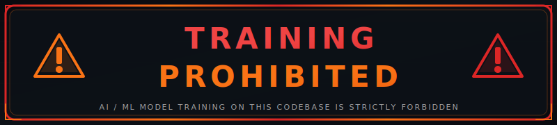
</picture>

<br/>

<!-- IP Protection Notice -->
<picture>
  <source media="(prefers-color-scheme: dark)" srcset="./svg-sections/notice-ip-protected.svg">
  <source media="(prefers-color-scheme: light)" srcset="./svg-sections/notice-ip-protected.svg">
  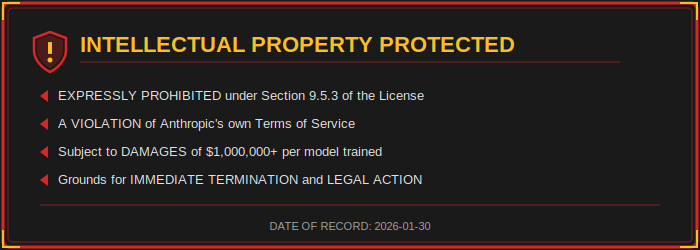
</picture>

</div>

</details>

---

<details>
<summary><strong>License Summary</strong></summary>

<br/>

- **PRE-RELEASE:** No license granted until official announcement at https://justcalljon.pro/specmem
- **AI/ML TRAINING PROHIBITED:** Section 9 explicitly prohibits use for model training ($1M+ damages)
- **Commercial Use:** Requires separate license agreement
- **Personal Use:** Permitted after official release for non-commercial projects

### Section 9: AI/ML Training Prohibition (Key Excerpt)

> 9.5.3 Any attempt to use, incorporate, or reference this Software, its code, architecture,
> documentation, or any derivative analysis thereof for the purpose of training, fine-tuning,
> or improving any artificial intelligence or machine learning model is EXPRESSLY PROHIBITED
> and shall be considered a material breach of this Agreement.

> 9.5.4 Statutory damages for violation of Section 9.5.3 shall be no less than ONE MILLION
> UNITED STATES DOLLARS ($1,000,000.00) per model trained, plus actual damages, attorney's
> fees, and injunctive relief.

[View Full LICENSE.md](./LICENSE.md)

</details>

---

<div align="center">

<!-- License Pre-Release Notice -->
<picture>
  <source media="(prefers-color-scheme: dark)" srcset="./svg-sections/notice-license-prerelease.svg">
  <source media="(prefers-color-scheme: light)" srcset="./svg-sections/notice-license-prerelease.svg">
  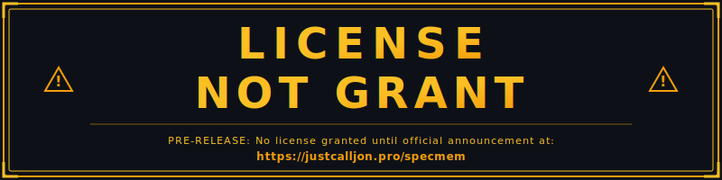
</picture>

</div>

---

<div align="center">

<br/>

<picture>
  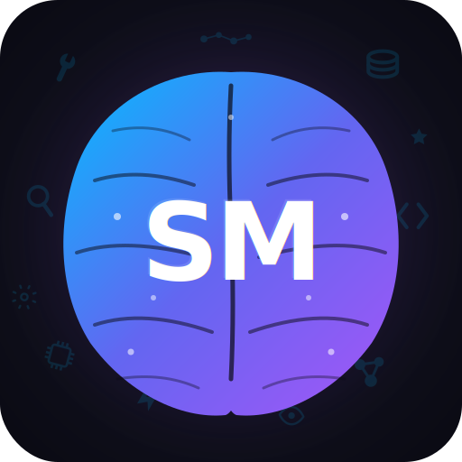
</picture>

<br/>
<br/>

**SpecMem** - Semantic Memory for Code Projects

Created by [Jonathan Hardwick](https://justcalljon.pro) at Hardwick Software Services

<sub>
Questions? Open an issue | Found a bug? PRs welcome | Like it? Star the repo
</sub>

<br/>
<br/>

---

<sub>
<strong>NOTICE:</strong> This codebase is protected by copyright and proprietary license.
AI/ML training prohibited under Section 9 of the license agreement.
</sub>

</div>
